# 🧠 AI Roadmap

### Learn AI from zero — 50 free, hands-on lessons from your first line of Python to shipping an LLM app.

     

**[🌐 Open the site](https://sumitsingh4411.github.io/ai-roadmap)** &nbsp;·&nbsp; **[▶️ Start lesson 1](https://sumitsingh4411.github.io/ai-roadmap/lessons/what-is-ai)** &nbsp;·&nbsp; **[🗺️ Roadmap](https://sumitsingh4411.github.io/ai-roadmap/roadmap)** &nbsp;·&nbsp; **[🛠️ Projects](https://sumitsingh4411.github.io/ai-roadmap/projects)** &nbsp;·&nbsp; **[💬 Interview prep](https://sumitsingh4411.github.io/ai-roadmap/interview)** &nbsp;·&nbsp; **[📑 Cheat sheets](https://sumitsingh4411.github.io/ai-roadmap/cheatsheets)** &nbsp;·&nbsp; **[🎯 What's next](https://sumitsingh4411.github.io/ai-roadmap/advanced)**

---

## ✨ Why this roadmap

Most people learning AI drown in scattered tutorials with no order and no idea what to learn next. This is **one dependency-ordered path** — every lesson tells you exactly what it assumes you already know, so you always know where you are and what comes next. It runs from *"what even is AI?"* all the way to fine-tuning models, building agents, and shipping them.

- 🆓 **Free and open forever** — MIT code, CC BY 4.0 content. No sign-up, paywall, or ads.
- 📖 **Learn right here on GitHub** — every lesson below is a plain Markdown file you can read without leaving. The [website](https://sumitsingh4411.github.io/ai-roadmap) is the same content with progress tracking, search, and a visual roadmap.
- ✅ **Runnable, verified code** — every sample was actually executed; the output you see is the output it produces.
- 🧩 **Build as you go** — 30+ project ideas, each mapped to the lesson it builds on.

## 🚀 Quick start

| You want to… | Do this |
|---|---|
| **Just learn** | Open the **[web app](https://sumitsingh4411.github.io/ai-roadmap)** — sidebar, search (`⌘K`), progress tracking, dark/light. |
| **Read on GitHub** | Start at **[What AI, ML, Deep Learning and GenAI Actually Are](content/lessons/00-what-is-ai.md)** and follow the curriculum below, top to bottom. |
| **Run it locally** | `npm install` → `npm run dev`. Build with `npm run build`, test with `npm test`. |

> **New to all this?** Do the lessons in order. Already know some? Each lesson lists its prerequisites — skip ahead whenever you already have them.

## 🗺️ The curriculum

**50 lessons · 7 stages · ~42 hours.** Seven stages, each building on the last:

```mermaid
flowchart LR
    S0["🧭 Orientation<br/><small>2 lessons</small>"]
    S1["🐍 Python & Data<br/><small>5 lessons</small>"]
    S2["📐 Math You Actually Need<br/><small>3 lessons</small>"]
    S3["🌳 Classical ML<br/><small>11 lessons</small>"]
    S4["🧠 Deep Learning<br/><small>9 lessons</small>"]
    S5["🤖 Generative AI & LLMs<br/><small>17 lessons</small>"]
    S6["🚀 Ship It<br/><small>3 lessons</small>"]
    S0 --> S1 --> S2 --> S3 --> S4 --> S5 --> S6
    class S0 s0;
    class S1 s1;
    class S2 s2;
    class S3 s3;
    class S4 s4;
    class S5 s5;
    class S6 s6;
    classDef s0 fill:#8b5cf622,stroke:#8b5cf6,stroke-width:2px,color:#e5e7eb;
    classDef s1 fill:#6366f122,stroke:#6366f1,stroke-width:2px,color:#e5e7eb;
    classDef s2 fill:#38bdf822,stroke:#38bdf8,stroke-width:2px,color:#e5e7eb;
    classDef s3 fill:#22d3ee22,stroke:#22d3ee,stroke-width:2px,color:#e5e7eb;
    classDef s4 fill:#2dd4bf22,stroke:#2dd4bf,stroke-width:2px,color:#e5e7eb;
    classDef s5 fill:#f59e0b22,stroke:#f59e0b,stroke-width:2px,color:#e5e7eb;
    classDef s6 fill:#fb718522,stroke:#fb7185,stroke-width:2px,color:#e5e7eb;
```

Click any lesson to read it right here on GitHub.

| Stage | Focus | Lessons |
|---|---|:--:|
| 🧭 **0 · Orientation** | Get your bearings before writing code | 2 |
| 🐍 **1 · Python & Data** | The everyday tools — Python, NumPy, pandas, plots | 5 |
| 📐 **2 · Math You Actually Need** | Just enough linear algebra, calculus & statistics | 3 |
| 🌳 **3 · Classical ML** | How machines learn from tables — regression to ensembles | 11 |
| 🧠 **4 · Deep Learning** | Neural networks, from one neuron to the transformer | 9 |
| 🤖 **5 · Generative AI & LLMs** | How LLMs work, and how to build with them | 17 |
| 🚀 **6 · Ship It** | Take a model off your laptop and ship it | 3 |

<b>🧭 Stage 0 · Orientation</b> &nbsp;—&nbsp; 2 lessons

| # | Lesson | Time | Level | What you'll learn |
|--:|---|--:|---|---|
| `00` | **[What AI, ML, Deep Learning and GenAI Actually Are](content/lessons/00-what-is-ai.md)** | 20m | beginner | The four words everyone mixes up, sorted out once, with a mental model you can keep. |
| `01` | **[How to Learn AI Without Burning Out](content/lessons/01-how-to-learn-ai.md)** | 15m | beginner | A realistic schedule, the order to learn things in, and the three traps that stop most beginners. |

<b>🐍 Stage 1 · Python & Data</b> &nbsp;—&nbsp; 5 lessons

| # | Lesson | Time | Level | What you'll learn |
|--:|---|--:|---|---|
| `02` | **[Python Basics](content/lessons/02-python-basics.md)** | 60m | beginner | Variables, lists, dicts, loops, functions, imports, and how to read the error messages you'll see constantly. |
| `03` | **[NumPy](content/lessons/03-numpy.md)** | 45m | beginner | Why arrays beat lists for numeric work, plus shape, dtype, indexing, broadcasting, and vectorised math. |
| `04` | **[Pandas](content/lessons/04-pandas.md)** | 50m | beginner | Series and DataFrames, loading CSVs, selecting and filtering rows, grouping, and handling missing values. |
| `05` | **[Data Visualization](content/lessons/05-data-visualization.md)** | 40m | beginner | Choosing the right chart type, matplotlib basics, plotting straight from pandas, and reading what a histogram tells you. |
| `06` | **[Real Datasets](content/lessons/06-real-datasets.md)** | 45m | beginner | Where to find datasets, loading messy CSVs, fixing types and dates, removing duplicates, spotting outliers, and a reusable cleaning checklist. |

<b>📐 Stage 2 · Math You Actually Need</b> &nbsp;—&nbsp; 3 lessons

| # | Lesson | Time | Level | What you'll learn |
|--:|---|--:|---|---|
| `07` | **[Linear Algebra](content/lessons/07-linear-algebra.md)** | 50m | beginner | Vectors and matrices as the data structures behind every model, dot products as weighted sums, and matrix multiplication as batch prediction. |
| `08` | **[Calculus](content/lessons/08-calculus.md)** | 50m | intermediate | Derivatives as slope, the chain rule, and gradient descent implemented by hand in NumPy — how a model actually learns. |
| `09` | **[Probability & Statistics](content/lessons/09-probability-stats.md)** | 50m | beginner | Distributions, mean and variance, conditional probability, Bayes' theorem, sampling, and what a p-value actually means. |

<b>🌳 Stage 3 · Classical ML</b> &nbsp;—&nbsp; 11 lessons

| # | Lesson | Time | Level | What you'll learn |
|--:|---|--:|---|---|
| `10` | **[ML Fundamentals](content/lessons/10-ml-fundamentals.md)** | 45m | beginner | Supervised vs unsupervised learning, the train/validation/test split, and overfitting vs underfitting through the bias-variance tradeoff. |
| `11` | **[Regression](content/lessons/11-regression.md)** | 50m | beginner | Linear regression from the normal equation to scikit-learn, the MSE/MAE/R² metrics, and Ridge/Lasso regularisation to fight overfitting. |
| `12` | **[Classification](content/lessons/12-classification.md)** | 50m | beginner | Logistic regression and the sigmoid, decision boundaries, k-nearest neighbours, and strategies for more than two classes. |
| `13` | **[Model Evaluation](content/lessons/13-model-evaluation.md)** | 45m | intermediate | The confusion matrix, precision, recall, F1, ROC-AUC, cross-validation, and why accuracy alone can make a worthless model look great. |
| `14` | **[Feature Engineering](content/lessons/14-feature-engineering.md)** | 45m | intermediate | Scaling, encoding categoricals, dates, binning, interaction terms, and data leakage — raising a model's score with features, not a new algorithm. |
| `15` | **[Clustering & PCA](content/lessons/15-clustering-pca.md)** | 45m | intermediate | k-means clustering, choosing k with the elbow method, hierarchical clustering, and PCA as compression with explained variance. |
| `16` | **[Trees & Ensembles](content/lessons/16-trees-ensembles.md)** | 50m | intermediate | Decision trees and how splits are chosen, random forests as bagging, gradient boosting, and feature importance. |
| `17` | **[First ML Project](content/lessons/17-first-ml-project.md)** | 90m | intermediate | A full guided ML pipeline end to end: problem framing, EDA, cleaning, features, baseline, iteration, evaluation, and writing up results. |
| `37` | **[Explainable AI — Opening the Black Box](content/lessons/37-explainable-ai.md)** | 45m | intermediate | Why a model made a prediction — feature importance, permutation importance, and reading a model you can't see inside. |
| `38` | **[Time-Series Forecasting](content/lessons/38-time-series.md)** | 50m | intermediate | Predicting what happens next — why time data breaks normal ML, lag features, a proper time-aware split, and honest baselines. |
| `45` | **[Recommender Systems](content/lessons/45-recommender-systems.md)** | 45m | intermediate | The engine behind every 'you might also like' — content-based vs collaborative filtering, similarity, and the cold-start problem. |

<b>🧠 Stage 4 · Deep Learning</b> &nbsp;—&nbsp; 9 lessons

| # | Lesson | Time | Level | What you'll learn |
|--:|---|--:|---|---|
| `18` | **[Neural Networks](content/lessons/18-neural-networks.md)** | 55m | intermediate | What one neuron computes, why nonlinear activations are non-negotiable, how depth builds representations, and the universal approximation intuition. |
| `19` | **[Backprop & Training](content/lessons/19-backprop-training.md)** | 60m | intermediate | How the chain rule turns one output error into a gradient for every weight in a network, and how learning rate, epochs and batches shape training. |
| `20` | **[PyTorch](content/lessons/20-pytorch.md)** | 60m | intermediate | Tensors, autograd, nn.Module, optimisers, and the canonical training loop — the framework that automates the backprop you just wrote by hand. |
| `21` | **[CNNs & Vision](content/lessons/21-cnns-vision.md)** | 55m | intermediate | Convolution as a learned filter, stride, padding and pooling, how a CNN's shapes flow layer to layer, and transfer learning with a pretrained backbone. |
| `22` | **[Sequence Models](content/lessons/22-sequence-models.md)** | 50m | advanced | Why order matters, how RNNs process sequences step by step, the vanishing gradient problem, LSTM/GRU, and why attention replaced them. |
| `23` | **[Transformers](content/lessons/23-transformers.md)** | 70m | advanced | Attention as a learned lookup over query, key and value, self-attention and multi-head attention, positional encoding, and the encoder/decoder split. |
| `39` | **[Reinforcement Learning](content/lessons/39-reinforcement-learning.md)** | 55m | advanced | Learning from reward instead of labels — agents, states, actions, rewards, and Q-learning taught by making an agent solve a tiny grid world. |
| `46` | **[Object Detection & Segmentation](content/lessons/46-object-detection.md)** | 50m | advanced | Beyond 'what's in this image?' to 'what's where?' — bounding boxes, IoU, non-max suppression, and how YOLO detects in real time. |
| `47` | **[Generative Adversarial Networks (GANs)](content/lessons/47-gans.md)** | 50m | advanced | Two networks in a duel — a generator faking data and a discriminator catching fakes — and how that adversarial game learns to create. |

<b>🤖 Stage 5 · Generative AI & LLMs</b> &nbsp;—&nbsp; 17 lessons

| # | Lesson | Time | Level | What you'll learn |
|--:|---|--:|---|---|
| `24` | **[How LLMs Work](content/lessons/24-how-llms-work.md)** | 55m | intermediate | Tokenization, next-token prediction, pretraining vs post-training, context windows, temperature and sampling, and why models hallucinate. |
| `25` | **[Prompt Engineering](content/lessons/25-prompt-engineering.md)** | 45m | beginner | Clear instructions, few-shot examples, chain-of-thought, structured output, system prompts, and fixing a failing prompt in documented iterations. |
| `26` | **[Embeddings](content/lessons/26-embeddings.md)** | 45m | intermediate | Text as vectors, cosine similarity, embedding models, vector databases, and chunking strategy, with a real semantic search built in NumPy. |
| `27` | **[Retrieval-Augmented Generation (RAG)](content/lessons/27-rag.md)** | 60m | intermediate | Why retrieval beats stuffing the context window, the ingest-chunk-embed-retrieve-generate pipeline, chunk sizing, and common RAG failure modes. |
| `28` | **[Fine-tuning](content/lessons/28-fine-tuning.md)** | 60m | advanced | When fine-tuning beats RAG or prompting, full fine-tuning vs LoRA/PEFT, dataset preparation, and evaluating the result, with a real LoRA parameter-count demo. |
| `29` | **[AI Agents](content/lessons/29-ai-agents.md)** | 60m | advanced | Tool use, the reason-act loop, planning, memory, multi-step failure modes, and cost control, with a real non-LLM demo of the loop mechanics. |
| `30` | **[Evals & Guardrails](content/lessons/30-evals-guardrails.md)** | 50m | advanced | Why manual spot-checking doesn't scale, building an eval set, LLM-as-judge and its biases, regression testing, and input/output guardrails. |
| `34` | **[Run Open LLMs Locally with Ollama](content/lessons/34-run-local-llm.md)** | 45m | intermediate | Run real language models on your own machine — private, free, offline — and call them from Python like an API. |
| `35` | **[Build an Agent Harness](content/lessons/35-agent-harness.md)** | 60m | advanced | The scaffolding that turns a raw language model into an agent: the tool loop, parsing, dispatch, and history — built from scratch. |
| `36` | **[Loop Engineering](content/lessons/36-loop-engineering.md)** | 55m | advanced | The naive agent loop breaks in a dozen ways. The engineering that makes it reliable: budgets, loop detection, context control, and error recovery. |
| `40` | **[Diffusion Models & Image Generation](content/lessons/40-diffusion-models.md)** | 55m | advanced | How Stable-Diffusion-style models turn noise into images — the forward noising process, learning to denoise, and why it works. |
| `41` | **[Vector Databases](content/lessons/41-vector-databases.md)** | 45m | intermediate | Where embeddings live at scale — similarity search, why brute force stops scaling, and how approximate nearest neighbors makes it fast. |
| `42` | **[Structured Outputs & Function Calling](content/lessons/42-structured-outputs.md)** | 45m | intermediate | Getting reliable JSON out of an LLM — schemas, validation, function/tool calling, and what to do when the model returns something wrong. |
| `43` | **[Model Context Protocol (MCP)](content/lessons/43-model-context-protocol.md)** | 45m | advanced | The USB-C of AI tools — a standard protocol that lets any agent connect to any tool or data source without custom glue for each one. |
| `44` | **[AI Ethics & Responsible AI](content/lessons/44-ai-ethics.md)** | 45m | intermediate | Building AI that doesn't cause harm — bias and fairness, privacy, transparency, misuse, and the responsibility that comes with shipping models. |
| `48` | **[Speech & Audio AI](content/lessons/48-speech-audio.md)** | 45m | intermediate | How machines hear — turning sound into spectrograms, speech-to-text with Whisper, and text-to-speech, from waveform to model input. |
| `49` | **[Multimodal AI (CLIP & Vision-Language Models)](content/lessons/49-multimodal.md)** | 50m | advanced | One model, many senses — how CLIP puts images and text in the same space, enabling zero-shot classification and image search. |

<b>🚀 Stage 6 · Ship It</b> &nbsp;—&nbsp; 3 lessons

| # | Lesson | Time | Level | What you'll learn |
|--:|---|--:|---|---|
| `31` | **[MLOps Basics](content/lessons/31-mlops-basics.md)** | 45m | intermediate | Experiment tracking, model and data versioning, reproducibility, and drift monitoring — what keeps a shipped model trustworthy after it leaves your notebook. |
| `32` | **[Deploying a Model](content/lessons/32-deploying-models.md)** | 55m | intermediate | Wrapping a trained model behind a validated FastAPI endpoint, measuring latency and batching, Dockerizing it, and free hosting options. |
| `33` | **[Portfolio and Career](content/lessons/33-portfolio-career.md)** | 40m | beginner | What makes a project worth showing, writing a README that gets read, the real AI job families, and how to keep learning after this roadmap. |

> Prefer a table of everything at a glance? See **[CURRICULUM.md](CURRICULUM.md)**.

## 🛠️ Build projects

You learn AI by making things. The **[Projects page](https://sumitsingh4411.github.io/ai-roadmap/projects)** has 30+ ideas across four tiers, each mapped to a lesson:

- 🟦 **Beginner** — Titanic predictor, a stats CLI, an MNIST digit recognizer, a tic-tac-toe AI.
- 🟪 **Intermediate** — semantic search, transfer-learning image classifier, an end-to-end churn model.
- 🟥 **Advanced / GenAI** — a RAG chatbot over your docs, LoRA fine-tuning, an AI agent, reproduce nanoGPT.
- 🟨 **Capstone** — a full-stack AI product, a Kaggle competition, reproduce a paper, an open-source contribution.

## 💬 Interview prep & cheat sheets

Two extras to get you job-ready and keep you fast:

- **[Interview questions](https://sumitsingh4411.github.io/ai-roadmap/interview)** — the ML, deep-learning, LLM, and system-design questions that actually come up, each with a clear answer and a link to the lesson that teaches it.
- **[Cheat sheets](https://sumitsingh4411.github.io/ai-roadmap/cheatsheets)** — one-page quick reference for Python, NumPy, pandas, scikit-learn, PyTorch, prompting, and the core ML concepts. Bookmark it.

## 🎯 After the roadmap

Finished? The **[What's next page](https://sumitsingh4411.github.io/ai-roadmap/advanced)** is a curated guide to going further — specializing (computer vision, RL, diffusion, LLMs from scratch), practicing on Kaggle, free courses & books, communities, MLOps, and turning it all into a career. Every resource is free.

## 💡 How to get the most out of it

- **Run every code sample.** Don't just read it — type it, break it, change the numbers. That's where the learning is.
- **Do the "Build this" exercise** at the end of each lesson before moving on.
- **Ship 3 projects** as you go (a data project, a deep-learning project, an LLM app). A public repo beats any certificate.
- **A few focused hours a week beats cramming** — the whole path is ~42 hours of reading.

## 🧑‍💻 Built with

[Astro](https://astro.build) static site · TypeScript · Markdown content · Shiki highlighting · deployed to GitHub Pages by CI, which validates content and runs 100+ tests on every push. The lessons are the product; the site is a nice reader over them.

## 🤝 Contributing

Spotted a bug or a clearer explanation? Issues and PRs are welcome.

- Lessons live in [`content/lessons/`](content/lessons) as portable Markdown — no site-specific syntax, so they read cleanly on GitHub too.
- Run `npm run validate -- --strict` and `npm test` before opening a PR; CI runs both.
- Lesson order and prerequisites are defined in [`content/roadmap.json`](content/roadmap.json).

## 📄 License

Code is [MIT](LICENSE). Lesson content is [CC BY 4.0](https://creativecommons.org/licenses/by/4.0/) — use it, remix it, just credit the source.

---

Built to be the roadmap I wish I'd had. ⭐ it if it helps — and <a href="https://sumitsingh4411.github.io/ai-roadmap">start learning →</a>

